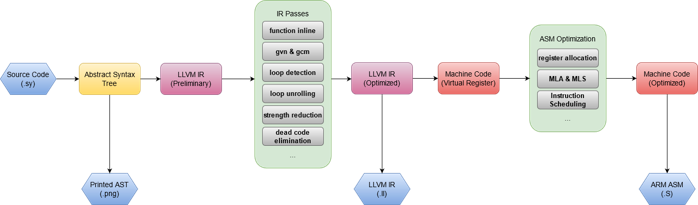

# TinyBAC C Compiler
## Introduction

This project has designed a C99 subset compiler with LLVM IR as an intermediate representation and ARM Thumb machine code as the compilation target. It supports language features such as integer operations, branching and conditional loops, function calls, and more. The compiler specifically offers the following functionalities:

1. Construct an Abstract Syntax Tree (**AST**) and output the syntax analysis result in *dot* file format.
2. Compile C code into **LLVM IR** intermediate representation and generate *IR* files.
3. Compile C code into **ARM Thumb** assembly code and produce *asm* files.

TinyBAC's compilation process from C programs to assembly language is illustrated in the following diagram:



TinyBAC compiler is designed for **maximizing the performance of program**, it provides common intermediate representation-based optimization techniques, including:

| Optimization                            | Brief Introduction                                           |
| --------------------------------------- | ------------------------------------------------------------ |
| Control-Flow Graph (CFG) Simplification | Remove unreachable basic blocks; eliminate unused PHI instructions; change branch statements with constant conditions into jump statements; merge basic blocks with only one jump instruction. |
| Function Inlining                       | Inline short-length functions and functions called only once to reduce the overhead of function calls and increase optimization opportunities for other optimizations. |
| Tail-Recursion Elimination              | Eliminate tail-recursive calls at the end of functions to save stack space. |
| Loop Unrolling                          | Save the overhead of jumps and conditional checks by copying loop body code multiple times. |
| Loop Constant Inference                 | Replace the calculation process with the computed result for loop variables whose values can be determined at compile time. |
| Automatic Vectorization                 | TinyBAC implements a simple SLP Vectorizer that can identify homogeneous instructions and merge them into SIMD instructions. |
| Global Value Numbering (GVN)            | Eliminate instructions with the same operation and operands. It needs to be used in conjunction with GCM to avoid issues where expressions are used before being computed. |
| Global Code Motion (GCM)                | This optimization includes two processes: Schedule Early and Schedule Late. Schedule Early moves instructions based on basic block dominance relationships to ensure that instructions are dominated by their operands. Schedule Late schedules all consumer instructions from the least common ancestor (LCA) of users on the dominance tree to the original location's chain, choosing the loop nest with the shallowest depth and the deepest dominance whenever possible. |
| Function Side-Effect Detection          | Mark functions containing Store and similar instructions as functions with side effects. Any functions calling functions with side effects are also considered to have side effects and cannot be merged with GVN. |
| Loop Strength Reduction                 | TinyBAC implements basic loop strength reduction by moving repeated calculations from nested loops to the outermost loop. |
| Aggressive Dead Code Elimination        | Consider instructions as dead code unless it can be proven that they are useful, and remove them accordingly. |

## Getting started

1. Before building TinyBAC, you need to get dependencies install to your system.

```bash
$ apt install bison flex gcc cmake
```

2. Use CMake to build this project

``` bash
$ cd <Project Directory> && mkdir build && cd build
$ cmake .. && make -j$(nproc)
```

3. Get this example program and save it to **test.c**

```c
int main(){
    int i;
    i = 0;
    int sum;
    sum = 0;
    while(i < 100){
        if(i == 50){
            i = i + 1;
            continue;
        }
        sum = sum + i;
        i = i + 1;
    }
    return sum;
}
```

3. Run TinyBAC C Compiler！

```bash
$ <Project Directory>/build/tinbaccc <Path to test.c> -i ir.ll -o asm.s 
```

4. You should get the compilation results as shown below

   * ir.ll

     ```llvm
     define i32 @main () {
     _entry:	; idom = %_entry dom_tree_depth = 0 loop_depth = 0 def_depth = 1
     	br label %_while.entry
     _while.entry:	; preds = %_entry, %_if.cont, %_while.true idom = %_entry dom_tree_depth = 1 loop_depth = 1 def_depth = 2
     	%x0 = phi i32 [ 0, %_entry ], [ %x0, %_while.true ], [ %x1, %_if.cont ]
     	%x2 = phi i32 [ 0, %_entry ], [ %x3, %_while.true ], [ %x3, %_if.cont ]
     	%x4 = icmp slt i32 %x2, 100
     	br i1 %x4, label %_while.true, label %_while.cont
     _while.true:	; preds = %_while.entry idom = %_while.entry dom_tree_depth = 2 loop_depth = 1 def_depth = 3
     	%x3 = add i32 %x2, 1
     	%x5 = icmp eq i32 %x2, 50
     	br i1 %x5, label %_while.entry, label %_if.cont
     _if.cont:	; preds = %_while.true idom = %_while.true dom_tree_depth = 3 loop_depth = 1 def_depth = 4
     	%x1 = add i32 %x0, %x2
     	br label %_while.entry
     _while.cont:	; preds = %_while.entry idom = %_while.entry dom_tree_depth = 2 loop_depth = 0 def_depth = 3
     	ret i32 %x0
     }
     ```

   * asm.s

     ```assembly
     	.arch armv8-a
     	.arch_extension crc
     	.text
     	.align 2
     	.global main
     	.arch armv8-a
     	.arch_extension crc
     	.syntax unified
     	.arm
     	.fpu crypto-neon-fp-armv8
     	.type main, %function
     main:
     	PUSH {lr}
     .L1:
     	@ir: _entry succ: .L2
     	MOV r0, #0
     	MOV r1, #0
     	@ nop: B .L2
     .L2:
     	@ir: _while.entry succ: .L3 .L5
     	@ nop: MOV r0, r0
     	MOV r2, r1
     	CMP r2, #100
     	BGE .L5
     	@ nop: B .L3
     .L3:
     	@ir: _while.true succ: .L4 .L2
     	ADD r1, r2, #1
     	@ nop: MOV r0, r0
     	@ nop: MOV r1, r1
     	CMP r2, #50
     	BEQ .L2
     	@ nop: B .L4
     .L4:
     	@ir: _if.cont succ: .L2
     	ADD r0, r0, r2
     	@ nop: MOV r0, r0
     	@ nop: MOV r1, r1
     	B .L2
     .L5:
     	@ir: _while.cont succ: .L0
     	@ nop: MOV r0, r0
     	@ nop: B .L0
     .L0:
     	 @END OF FUNCTION
     	POP {pc}
     	.pool
     	.size main, .-main
     	b getint
     ```

     